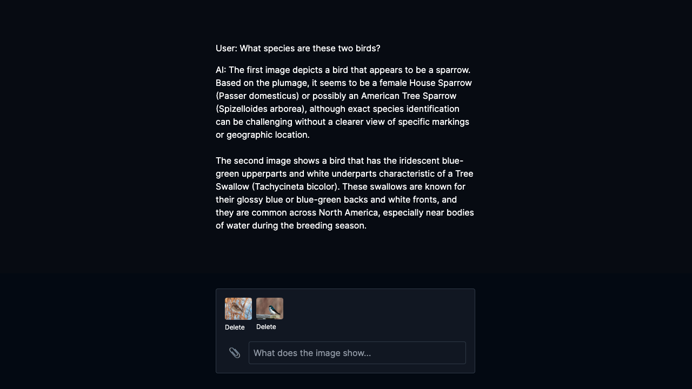

# Next GPT-4V

A simple chat app with vision using [Next.js](https://nextjs.org/), [Vercel AI SDK](https://github.com/vercel/ai), and [GPT-4V](https://platform.openai.com/docs/guides/vision).



## Setup

1. Clone the repo:

```sh
git clone https://github.com/komzweb/nextjs-gpt4v.git
```

2. Add your OpenAI API key:

```sh
cd nextjs-gpt4v
cp .env.local.example .env.local
```

Set your secret API key to `OPENAI_API_KEY` in the `.env.local` file.

3. Install dependencies:

```sh
npm install
```

4. Run the server:

```sh
npm run dev
```

Open [http://localhost:3000](http://localhost:3000) in your browser and try chatting with images.